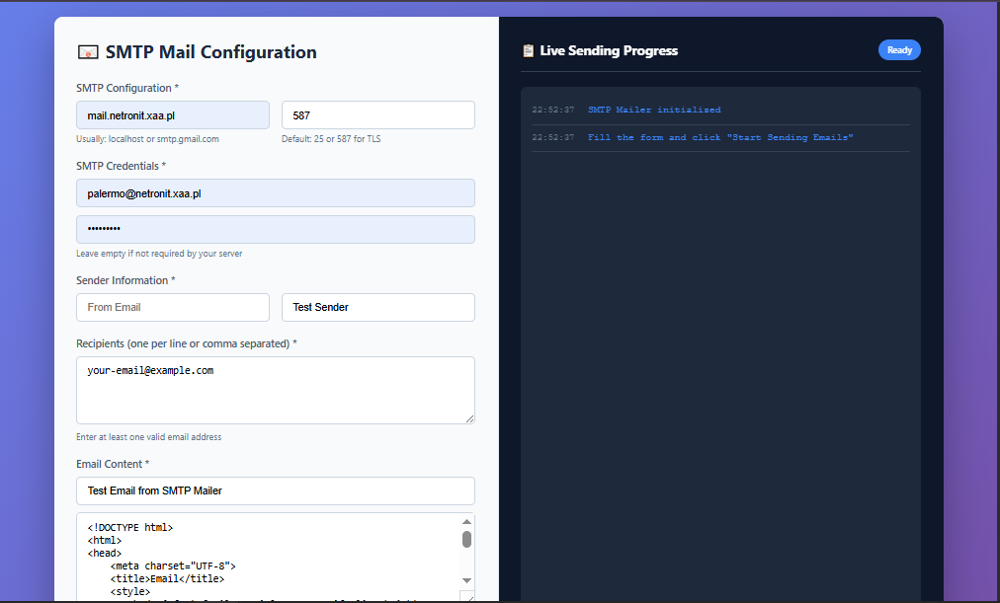

# 📧 SMTP Mailer

A powerful, open-source bulk email sending tool with real-time progress tracking and beautiful interface.



## ✨ Features

- **Bulk Email Sending** - Send emails to multiple recipients simultaneously
- **Real-time Progress** - Live tracking with progress bar and statistics
- **HTML Email Support** - Send beautifully formatted HTML emails
- **Modern UI** - Clean, professional interface with dark/light themes
- **No Dependencies** - Single PHP file, no external libraries required
- **Session Management** - Resume sending if interrupted

## 🚀 Quick Start

1. **Upload** the `Mailer.php` file to your web server
2. **Access** the file via your browser
3. **Configure** your sender information
4. **Add** recipient emails
5. **Write** your email content
6. **Click** "Start Sending"

## 📋 Requirements

- PHP 7.4 or higher
- Web server with mail() function enabled
- SMTP server or local mail configuration

## ⚙️ Configuration

The application uses PHP's built-in `mail()` function. For proper email delivery:

1. **Local Server**: Configure Sendmail/Postfix
2. **Shared Hosting**: Usually pre-configured
3. **Custom SMTP**: Edit the `sendEmail()` function in index.php

## 🎯 Usage Examples

### Basic Usage
```php
// Enter sender email
// Add recipient emails (one per line)
// Write subject and HTML content
// Click "Start Sending"
